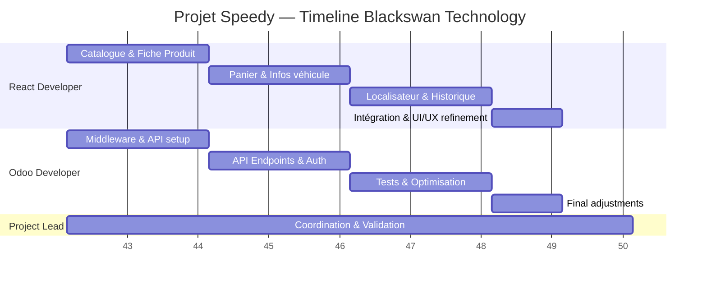

# 📅 Projet Speedy — Plan de mise en œuvre (8 semaines) — Blackswan Technology

---

## 🗓️ Chronogramme du projet (8 semaines)

| Semaine | Développeur React | Développeur Odoo | Livrables clés |
|---------|------------------|-----------------|----------------|
| **1** | Revue des spécifications, définition structure React | Définition architecture API, mise en place middleware | ✅ Spécifications et architecture validées |
| **2** | Début Catalogue & Fiche Produit | Authentification sécurisée, endpoints produit et entrepôt | ✅ Middleware fonctionnel de base |
| **3** | Finalisation Catalogue & Fiche Produit | Pagination, cache, gestion erreurs | ✅ Démo catalogue produit |
| **4** | Panier & Infos véhicule | Intégration création commande (`sale.order`) et POS | ✅ Flux panier et création commande prêts |
| **5** | Localisateur magasins (code postal + géolocalisation) | Optimisation échanges de données | ✅ Localisateur intégré |
| **6** | Historique commandes et authentification client | Finalisation tests middleware et documentation | ✅ Tous composants fonctionnels |
| **7** | Intégration complète, UI/UX refinement | Tests intégration complets | ✅ Démo intégration complète livrée |
| **8** | QA, corrections, préparation livraison | Ajustements finaux et revue endpoints | ✅ Livraison finale et documentation prête |

---

## 📦 Livrables par phase

| Phase | Livrables |
|-------|-----------|
| **Semaines 1–2** | Middleware setup, architecture validée, structure initiale React |
| **Semaines 3–6** | Composants React fonctionnels complets et middleware stable |
| **Semaine 7** | Intégration front-end / back-end complète |
| **Semaine 8** | QA finale, documentation, livraison projet |

---

## 🧩 Répartition de la charge

| Rôle | Implication | Responsabilités principales |
|------|------------|-----------------------------|
| **Développeur React** | ~55% | Développer 6 composants UI et assurer flux de données |
| **Développeur Odoo** | ~35% | Construire middleware, gérer données Odoo et endpoints |
| **Chef de projet** | ~10% | Coordination, validation et documentation |

---

## 🏁 Résultat final
- Composants React opérationnels intégrés à Odoo  
- Middleware sécurisé assurant communication fluide  
- Projet livré, testé et documenté en 8 semaines

---

## 🕒 Gantt du projet

---

## ✅ Tâches accomplies

### Semaine 1
- [ ] Revue des spécifications et définition structure React
- [ ] Définition architecture API et mise en place middleware
- [ ] Lancement projet et validation périmètre technique

### Semaine 2
- [ ] Début développement Catalogue & Fiche Produit
- [ ] Authentification sécurisée et endpoints produit
- [ ] Coordination mise en place et validation API

### Semaine 3
- [ ] Finalisation Catalogue & Fiche Produit
- [ ] Pagination, cache et gestion erreurs
- [ ] Supervision intégration inter-équipes

### Semaine 4
- [ ] Panier & Infos véhicule
- [ ] Intégration création commande et POS
- [ ] Validation workflow commande

### Semaine 5
- [ ] Localisateur magasins (code postal + géolocalisation)
- [ ] Optimisation échanges de données
- [ ] Coordination des tests

### Semaine 6
- [ ] Historique commandes et authentification client
- [ ] Finalisation tests middleware et documentation
- [ ] Validation des fonctionnalités

### Semaine 7
- [ ] Intégration complète et UI/UX refinement
- [ ] Tests intégration complets
- [ ] Gestion retours client

### Semaine 8
- [ ] QA, corrections et préparation livraison
- [ ] Ajustements finaux et revue endpoints
- [ ] Validation finale et remise projet

---

## ⚠️ Difficultés potentielles du projet

### Techniques
- **Intégration React-Odoo** : Synchronisation des données entre les deux systèmes peut être complexe
- **Performance** : Gestion du cache et optimisation des requêtes API pour éviter les lenteurs
- **Sécurité** : Mise en place d'une authentification robuste entre React et Odoo
- **Géolocalisation** : Intégration des services de localisation et gestion des permissions navigateur

### Organisationnelles
- **Coordination équipes** : Synchronisation entre développeurs React et Odoo
- **Tests d'intégration** : Validation complète du workflow bout en bout
- **Documentation** : Maintien de la documentation à jour pendant le développement

### Fonctionnelles
- **Gestion des erreurs** : Traitement des cas d'erreur dans le flux de commande
- **UX/UI** : Adaptation de l'interface aux contraintes Odoo
- **Compatibilité navigateurs** : Tests sur différents navigateurs et appareils
